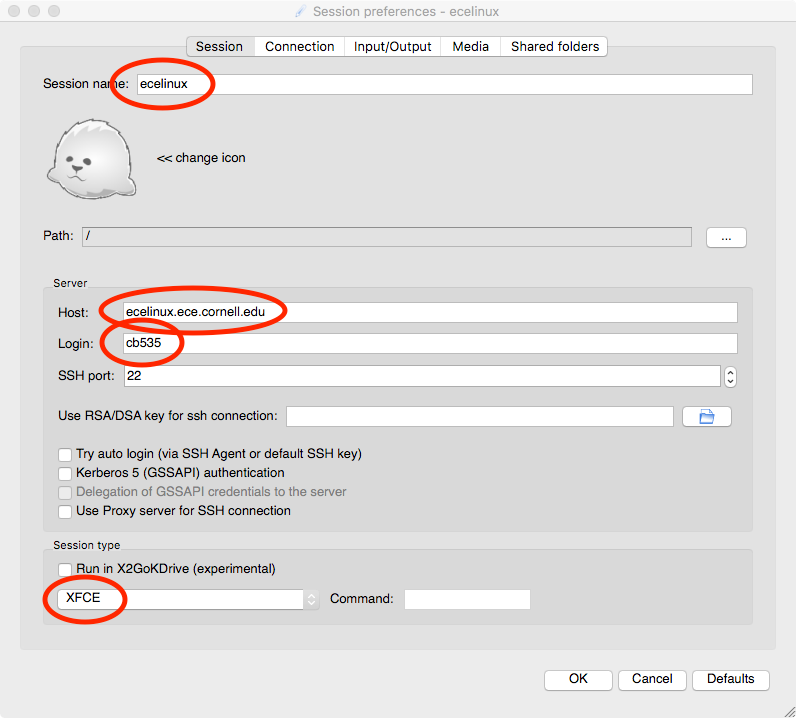
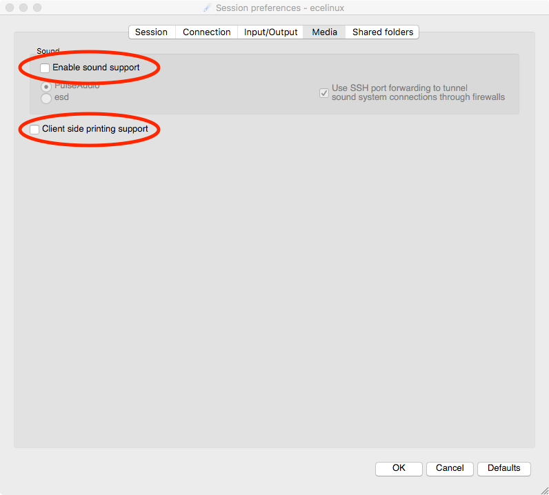
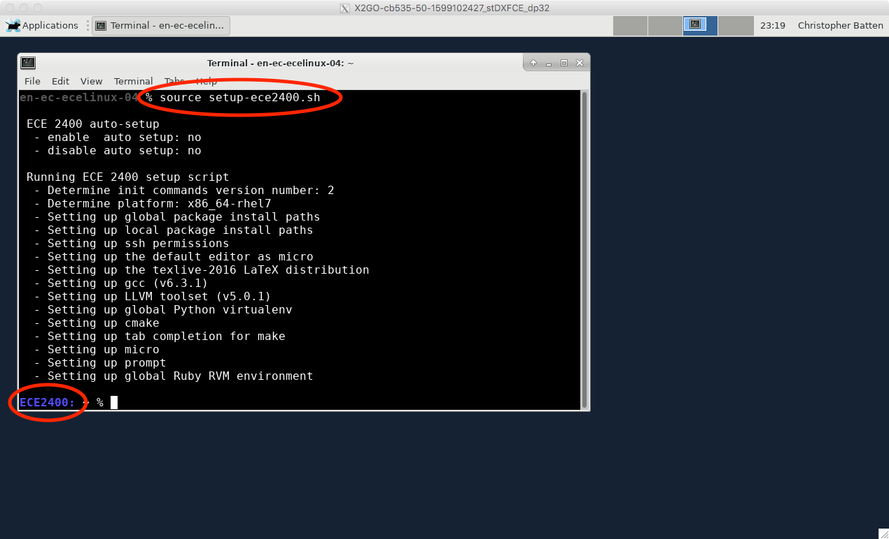

Section 1: Linux Development Environment
==========================================================================

This section serves as gentle introduction to the basics of using the
Linux development environment on the `ecelinux` servers including how to
log into the servers, how to work at the Linux command line, and how to
use Git version control.

1. The ecelinux Servers
--------------------------------------------------------------------------

We will be using the `ecelinux` servers for all of the programming
assignments. The `ecelinux` servers all run the Red Hat Enterprise Linux
7 operating system, and they all use an identical setup. Linux is the
operating system of choice for both cloud and IoT systems, so becoming
familiar with Linux will pay dividends beyond just this course.

### 1.1. For In-Person Students

If you are participating in the discussion section in-person in 225 Upson
Hall, then all you need to do is find a free workstation and use the
following steps:

 - log in to the workstation using your NetID and standard NetID password
 - double click the X2Go client on the desktop
 - setup a new X2go session by configuring the _Session_ and _Media_ tabs
    - session name: _ecelinux_
    - host: _ecelinux.ece.cornell.edu_
    - login: _cb535_
    - session type: _XFCE_
    - uncheck _enable sound support_
    - uncheck _client side printing support_
 - click _OK_
 - enter your standard NetID password
 - if asked to trust a certificate for the servers, click _yes_
 - if asked about a Windows firewall setup, click _cancel_

  

  

### 1.2. For Remote Access Students

If you are participating in the discussion section remotely, then
hopefully you have already gone through the steps in Tutorial 1 of the
course:

 - https://www.csl.cornell.edu/courses/ece2400/handouts/ece2400-tut1-x2go.pdf

You need to setup the Cornell VPN and install X2go on your local
laptop/workstation. If you haven't done this yet, you need to go ahead
and do this now.

### 1.3. Linux Virtual Desktop

Once you have started X2go and logged into the `ecelinux` servers, then
you should see the Linux virtual desktop. Note that the Linux virtual
desktop is running on the `ecelinux` server, so anything you do in the
Linux virtual deskop is actually happening on the server and not on your
local laptop/workstation.

The next step is to open a new terminal by choosing _Applications >
Terminal Emulator_ from the _Applications_ menu in the upper-left corner
of the Linux virtual desktop. The following screenshot shows a terminal
opened on the Linux virtual desktop.

  

### 1.4. Souce the Course Setup Script

The very first thing you need to do after opening a terminal is source
the course setup script. This will ensure your environment is setup with
everything you need for working on the programming assignments. Enter the
following command on the command line:

    :::bash
    % source setup-ece2400.sh

Note that you do not need to enter `%` character. In a tutorial like
this, the `%` simply indicates what you should type at the command line.
You should now see `ECE 2400` in your prompt which means your environment
is setup for the course.

It can be tedious to always remember to source the course setup script.
You can also use _auto setup_ which will automatically source the course
setup for you when you log in. Note that if the environment for ECE 2400
conflicts with the environment required by a different course then you
will need to manually source the setup script when you are working on
this course. Enter the following command on the command line to use
auto setup:

    :::bash
    % source setup-ece2400.sh --enable-auto-setup

Now close the terminal using the X icon in the upper right-hand corner of
the terminal window. Reopen a new terminal window. You should see `ECE
2400` in the prompt meaning your environment is automatically setup for
the course. If at anytime you need to disable auto setup you can use the
following command:

    :::bash
    % source setup-ece2400.sh --disable-auto-setup

Now that we have source the course setup script we can start to explore
the Linux command line.

2. Linux Command Line
--------------------------------------------------------------------------

We will using the `ecelinux` servers which run the Red Hat Enterprise
Linux 7 operating system for all of the programming assignments. The
heart of the Linux operating system is the Linux command line. This is a
text-based console where you can enter commands to interact with the
operating system.

### 2.1 Hello World

We begin with the ubiquitous "Hello, World" example. To display the
message "Hello, World" we will use the `echo` command. The `echo` command
simply "echoes" its input to the console.

    :::bash
    % echo "Hello, World"

The string we provide to the echo command is called a _command line
argument_. We use command line arguments to tell commands what they
should operate on. Again, note that you do not need to enter `%`
character.

!!! note "To-Do On Your Own"

    Experiment with using the `echo` command to display different
    messages.

### 2.2. Manual Pages

You can learn more about any Linux command by using the `man` command.
Try using this to learn more about the `echo` command.

    :::bash
    % man echo

You can use the up/down keys to scroll the manual one line at a time, the
space bar to scroll down one page at a time, and the `q` key to quit
viewing the manual.

### 2.3. Create, View, and List Files

We can use the echo command and a feature called _command output
redirection_ to create simple text files. Command output redirection is
discussed more in the full tutorial. Command output redirection uses the
`>` operator to take the output from one command and "redirect" it to a
file. The following commands will create a new file named
`ece2400-sec1.txt` that simply contains the text "Computer Systems
Programming".

    :::bash
    % echo "Computer Systems Programming" > ece2400-sec1.txt

We can use the `cat` command to quickly display the contents of a file.

    :::bash
    % cat ece2400-sec1.txt

For larger files, `cat` will output the entire file to the console so it
may be hard to read the file as it streams past. We can use the `less`
command to show one screen-full of text at a time. You can use the
up/down keys to scroll the file one line at a time, the space bar to
scroll down one page at a time, and the `q` key to quit viewing the file.

    :::bash
    % less ece2400-sec1.txt

You can use the `ls` command to list the filenames of the files you have
created.

    :::bash
    % ls

We can provide command line options to the `ls` command to modify the
command’s behavior. For example, we can use the `-1` (i.e., a dash
followed by the number one) command line option to list one file per
line, and we can we can use the `-l` (i.e., a dash followed by the letter
l) command line option to provide a longer listing with more information
about each file.

!!! note "To-Do On Your Own"

    Create a new file named `ece2400-sec1-layer3.txt` which contains the
    third layer in the computing systems stack (i.e., programming
    language). Use `cat` and `less` to verify the file contents.

### 2.4. Create, Change, and List Directories

Obviously, having all files in a single location would be hard to manage
effectively. We can use directories (also called folders) to logically
organize our files, just like one can use physical folders to organize
physical pieces of paper. The mechanism for organizing files and
directories is called the file system. When you first login to an
`ecelinux` machine, you will be in your home directory. This is your own
private space on the server that you can use to work on the programming
assignments and store your files. You can use the `pwd` command to print
the directory in which you are currently working, which is known as the
current working directory.

    :::bash
    % pwd
    /home/netid

You should see output similar to what is shown above, but instead of
`netid` it should show your actual NetID. The pwd command shows a
directory path. A directory path is a list of nested directory names; it
describes a "path" to get to a specific file or directory. So the above
path indicates that there is a toplevel directory named home that
contains a directory named `netid`. This is the directory path to your
home directory. As an aside, notice that Linux uses a forward slash (`/`)
to separate directories, while Windows uses a back slash (`\`) for the
same purpose.

We can use the `mkdir` command to make new directories. The following
command will make a new directory named `ece2400` within your home
directory.

    :::bash
    % mkdir ece2400

We can use the `cd` command to change our current working directory. The
following command will change the current working directory to be the
newly created `ece2400` directory, before displaying the current working
directory with the pwd command.

    :::bash
    % cd ece2400
    % pwd
    /home/netid/ece2400

Use the `mkdir`, `cd`, and `pwd` commands to make another directory.

    :::bash
    % mkdir sec1
    % cd sec1
    % pwd
    /home/netid/ece2400/sec1

We sometimes say that `sec1` is a subdirectory or a child directory of
the `ece2400` directory. We might also say that the `ece2400` directory
is the parent directory of the `sec1` directory. Use the following
command to create a new file in this child directory.

    :::bash
    % cd /home/netid/ece2400/sec1
    % echo "Computer Systems Programming" > ece2400-sec1.txt
    % mkdir dirA
    % ls

You can use the `tree` command to visualize the directory layout and
where files are located:

    :::bash
    % cd ~/ece2400
    % tree

Note that the tilde character (`~`) is a shortcut which always refers to
your home directory. There are a few other very useful shortcuts. You can
use a single dot (`.`) to refer to the current working directory, and you
can use a double dot (`..`) to refer to the parent directory of the
current working directory.

    :::bash
    % cd ~/ece2400/sec1
    % cd ..
    % cd ..
    % pwd

!!! note "To-Do On Your Own"

    Experiment with creating additional directories and files within the
    `ece2400/sec1` subdirectory. Try using the `tree` command to display
    your newly created directory hierarchy.

### 2.5. Copy, Move, and Remove Files and Directories

We can use the `cp` command to copy files. The first argument is the name
of the file you want to copy, and the second argument is the new name to
give to the copy. The following commands will make two copies of the
files we created in the previous section.

    :::bash
    % cd ~/ece2400/sec1
    % cp ece2400-sec1.txt ece2400-sec1-a.txt
    % cp ece2400-sec1.txt ece2400-sec1-b.txt
    % ls

Instead of copying we can also move a file with the `mv` command:

    :::bash
    % cd ~/ece2400/sec1
    % mv ece2400-sec1.txt ece2400-sec1-c.txt
    % ls

Finally, we can use the `rm` command to remove files.

    :::bash
    % cd ~/ece2400/sec1
    % ls
    % rm ece2400-sec1-a.txt

!!! note "To-Do On Your Own"

    Creating additional directories and files within the `ece2400/sec1`
    subdirectory, and then use the `cp`, `mv`, and `rm` commands to copy,
    move, and remove the newly created directories and files. Use the
    `ls` and `tree` commands to display your file and directory
    organization.

### 2.6. Text Editors

Students are free to use any text editor they want. We recommend using
either Micro or Geany. You can start Micro like this:

    :::bash
    % micro ece2400-sec1-b.txt

Micro is a lightweight text-based text editor. Use _Ctrl-G_ to learn more
about the keyboard shortcuts you can use to in Micro.

You can start Geany like this:

    :::bash
    % geany ece2400-sec1-b.txt &

Geany is a graphical-based text editor. Notice the `&` character at the
end of the command line. This indicates that Linux should run Geany in
the background meaning you can still work at the command line while Geany
is running in a different window.

!!! note "To-Do On Your Own"

    Try editing the `ece2400-sec1.txt` file you created earlier using
    either Micro or Geany. Save the file and then view your changes from
    the command line using `cat`.

When you are finished go ahead and delete the `sec1` directory to keep
things tidy.

    :::bash
    % rm -r ~/ece2400/sec1

3. GitHub Account Setup
--------------------------------------------------------------------------

We will be using GitHub for centralized repository hosting. You can check
to see if you have a GitHub account on `github.com` using this link:
`https://github.com/githubid` where `githubid` is your GitHub username on
`github.com`. If the above link does not work, then you do not have an
GitHub account on `github.com`. **NOTE: We are using `github.com` not the
Cornell hosted GitHub!** You will need to create one here:

 - <https://github.com/join>

Your NetID makes a great GitHub username on `github.com`. Be sure to use
your Cornell University email address.

Once your account is setup, please make sure you set your full name so we
can know who you are on GitHub. Please also consider uploading a profile
photo to GitHub; it makes it more fun to interact on GitHub if we all
know what each other look like. Go to the following page and enter your
first and last name in the Name field, and then consider uploading a
profile photo.

 - <https://github.com/settings/profile>

Once you have a GitHub ID, please fill out the following online so the
instructors know the mapping from NetID to GitHub ID:

 - <http://www.csl.cornell.edu/courses/ece2400/signup>

Before you can begin using GitHub, you need to create an SSH key pair on
an `ecelinux` machine and upload the corresponding SSH public key to
GitHub. GitHub uses these keys for authentication. The course setup
script takes care of creating an SSH key pair which you can use. View the
contents of your public key using the following commands:

    :::bash
    % cat ~/.ssh/ece2400-github.pub

Use the following page to upload the public key to GitHub:

 - <https://github.com/settings/ssh>

Click on _New SSH Key_, and then cut-and-paste the public key you
displayed using cat into the key textbox. Give the key the title
`ece2400-github`. Then click _Add SSH key_. To test things out try the
following command:

    :::bash
    % ssh -T git@github.com

You may see a warning about the authenticity of the host. Don’t worry,
this is supposed to happen the first time you access GitHub using your
new key. Just enter `yes`. The GitHub server should output some text
including your GitHub ID. Verify that the GitHub ID is correct, and then
you should be all set.

4. Git Version Control System
--------------------------------------------------------------------------

In this course, we will be using Git as our revision control and source
code management system. Git will enable us to adopt an agile hardware
development methodology so you (and your group) can rapidly collaborate
and iterate on the design, verification, and evaluation of the
assignments.

### 4.1. Fork and Clone a Repo from GitHub

Fork'ing a repo means making a copy of that repo for your own local use.
We won't actually be forking repos for the programming assignments, but
it is an easy way for you to grab some example code for the discussion
section. Go to the example repo here:

 - <https://github.com/cornell-ece2400/ece2400-sec1>

Click on the "Fork" button. Wait a few seconds and then visit the new
copy of this repo in your own person GitHub workspace:

 - `https://github.com/githubid/ece2400-sec1`

Where `githubid` is your GitHubID. Now let's clone your new repo to the
`ecelinux` machine.

    :::bash
    % cd ${HOME}/ece2400
    % git clone git@github.com:githubid/ece2400-sec1 sec1
    % cd sec1
    % cat README.md

Where `githubid` is your GitHubID.

### 4.2. Adding and Committing Files to Local Repository

Now let's add some new files to the repository. Use your favorite text
editor (e.g., Micro, Geany) to create a file named `warm-colors.txt` with
three warm colors:

    red
    orange
    yellow

Now use your favorite text editor again to create a file named
`cool-colors.txt` with three cool colors.

    blue
    green
    purple

Now let's add these files to our repository. First use the `git status`
command to check on the status of the repository.

    :::bash
    % cd ${HOME}/ece2400/sec1
    % git status

You should see that git has noticed two "untracked files" which are in
the working directory but are not currently being tracked by git. Let's
"add" these two files to git's "staging" area so it now knows it should
keep track of them:

    :::bash
    % cd ${HOME}/ece2400/sec1
    % git add warm-colors.txt
    % git add cool-colors.txt
    % git status

The status of these two files have changed. Git reports that both of the
new files are ready to be committed. Let's go ahead and commit these
changes into your local repository.

    :::bash
    % cd ${HOME}/ece2400/sec1
    % git commit -m "add some colors"

!!! note "To-Do On Your Own"

    Try adding `cyan` to the `cool-colors.txt` file you created earlier
    using either Micro or Geany. Save the file and then view your changes
    from the command line using `cat`. Then use `git status`, `git add`,
    and `git commit` to add these changes to local repository.

### 4.3. Pushing Files to GitHub

Note that nothing has happened on GitHub yet. GitHub does _not_ know
anything about these local changes. We need to explicitly "push" our new
commits up to GitHub like this:

    :::bash
    % cd ${HOME}/ece2400/sec1
    % git push

Now go to the repository page using the GitHub web interface and verify
that there are two new files.

 - <https://github.com/githubid/ece2400-sec1>

!!! note "To-Do On Your Own"

    Try adding `mustard` to the `warm-colors.txt` file you created
    earlier using either Micro or Geany. Save the file and then view your
    changes from the command line using `cat`. Then use `git status`,
    `git add`, and `git commit` to add these changes to local repository,
    and then use `git push` to push these changes up to GitHub. View the
    changes using the GitHub web interface.

### 4.4. Pulling Files from GitHub

Let's try making a change to this repository through the GitHub
web interface.

 - <https://github.com/githubid/ece2400-sec1>

Click on _Create new file_. Name the file `languages.txt` and add a list
of programming languages:

    C
    C++
    Python
    MATLAB
    Java

Now click _Commit new file_. Verify that there is a new file in the repo
using the GitHub web interface. Now let's "pull" these new changes from
GitHub to your local repo on `ecelinux`:

    :::bash
    % cd ${HOME}/ece2400/sec1
    % git pull
    % cat languages.txt

This will be the basic GitHub workflow were students pull and push code
between GitHub and the `ecelinux` machines.

!!! note "To-Do On Your Own"

    Try editing a file using the GitHub web interface. Click on the
    `warm-colors.txt` file and then click on the pencil in the right-hand
    corner to edit this text file. Add another warm color. Click _Commit
    changes_. Then pull these changes to the local repository on the
    `ecelinux` server and verify that your new warm color is included.

