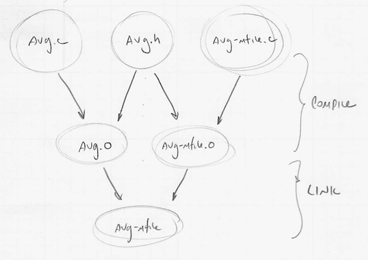

Section 2: Compiling and Running C Programs
==========================================================================

This section serves as gentle introduction to the basics of compiling and
running C programs on the `ecelinux` machines.

1. Logging Into ecelinux
--------------------------------------------------------------------------

Follow the same process as in the last section. If you are participating
in the discussion section in-person in 225 Upson Hall, then all you need
to do is find a free workstation and log into the workstation using your
NetID and standard NetID password. Remote access students might also need
to start the Cornell VPN. Then connect to `ecelinux` using X2go:

 - start X2go (in Upson 225 just double click the X2Go client on the desktop)
 - double click on the `ecelinux` session or ...
 - setup a new X2go session by configuring the _Session_ and _Media_ tabs
    - session name: _ecelinux_
    - host: _ecelinux.ece.cornell.edu_
    - login: _cb535_
    - session type: _XFCE_
    - uncheck _enable sound support_
    - uncheck _client side printing support_
 - click _OK_
 - enter your standard NetID password
 - if asked to trust a certificate for the servers, click _yes_
 - if asked about a Windows firewall setup, click _cancel_
 - open a terminal using _Applications > Terminal Emulator_
    from the _Applications_ menu
 - make sure you source the setup script
 - verify ECE2400 is in your prompt

Now clone the GitHub repo we will be using in this section using the
following commands:

    :::bash
    % source setup-ece2400.sh
    % mkdir -p ${HOME}/ece2400
    % cd ${HOME}/ece2400
    % git clone git@github.com:cornell-ece2400/ece2400-sec2 sec2
    % cd sec2
    % cat README.md

2. Using Online Tools to Explore C Programs
--------------------------------------------------------------------------

In this section, we will explore Repl.it which enables us to write,
compile, and run C programs in the cloud. We won't have time to explore
Compiler Explorer which enables us to compile C programs and view the
corresponding machine instructions in the cloud, but we do encourage
students to experiment with Compiler Explorer at <https://godbolt.org>.

As mentioned, Repl.it is a free online service which supports writing,
compiling, and executing C/C++ programs completely online in your
browser. It will enable us to quickly explore small C/C++ code snippets.
Start a browser and go to <https://Repl.it>. You can use Repl.it without
an account. You can always create an account later. Click the _plus_ icon
in the upper right-hand corner. In the _Language_ drop-down choose C and
the click _Create repl_. You will see a default program. Replace this
default program with the following program inspired by lecture.

    #include <stdio.h>

    int avg( int x, int y )
    {
      int sum = x + y;
      return sum / 2;
    }

    int main()
    {
      int a = 10;
      int b = 20;
      int c = avg( a, b );
      printf( "average of %d and %d is %d\n", a, b, c );
      return  0;
    }

Click _run_. This will compile and execute your C program in the cloud
and then display the output on the right.

We will be using Repl.it throughout the course. We strongly encourage
students to experiment with Repl.it frequently. The best way to truly
understand computer systems programming with C and C++ is to actually
write programs, and the easiest way to write C and C++ programs is to
just use Repl.it!

!!! note "To-Do On Your Own"

    Change the value of `b` to 15. Recompile and execute your C program.
    Is the result what you expect? Modify the `avg` function to find the
    average of three values instead of just two. Modify the `main`
    function to properly call your updated function and verify it
    calculates the average correctly.

3. C Preprocessor
--------------------------------------------------------------------------

Before we can understand how to write and compile C programs, we need to
understand the C preprocessor. The preprocessor takes an input C source
file, preprocesses it, and generates the preprocessed version of the C
source file. It is important to realize that the C preprocessor is not
really part of the C programming language. The C preprocessor simply
manipulates the plain text in the C source files and knows nothing about
the C programming language's syntax or semantics. The C preprocessor is
powerful but also very easy to abuse. Using the C preprocessor can cause
subtle bugs and is usually not necessary. Unfortunately, there are a few
cases where we have no choice but to use the C preprocessor, so we must
learn at least the basics.

The best way to understand the C preprocessor is actually to use it to
preprocess plain text files as opposed to C source files. Assume we wish
to create a plain text file which includes both warm and cool colors. We
could simply copy-and-paste our lists from `warm-colors.txt` and
`cool-colors.txt`, but this would be redundant and difficult to maintain
if we wanted to add a new warm or cool color. We can instead use the C
preprocessor to _include_ the contents of one text file in another text
file. Use Geany (or Micro) to create a new file named `colors-in.txt`
like this:

    :::bash
    % cd ${HOME}/ece2400/sec2
    % micro colors-in.txt

Put the following content into this file:

    #include "warm-colors.txt"
    #include "cool-colors.txt"

The C preprocessor copies the input source file to the output source
file, while also looking for _C preprocessor directives_. All C
preprocessor directives begin with the special `#` character. The
`#include` directive specifies the file name of a different text file to
include. The file name should be be specified using double quotes (`""`).

Now we can use the C preprocessor (`cpp`) to preprocess the `-in.txt`
files into a final text file that contains both the warm and cool colors.

    :::bash
    % cd ${HOME}/ece2400/sec2
    % cpp -o colors.txt colors-in.txt
    % cat colors.txt

The `-o` command line option is used to specify the name of the output
file. The content of the `colors.txt` should look like this:

    # 1 "colors-in.txt"
    # 1 "<built-in>"
    # 1 "<command-line>"
    # 31 "<command-line>"
    # 1 "/usr/include/stdc-predef.h" 1 3 4
    # 32 "<command-line>" 2
    # 1 "colors-in.txt"
    # 1 "warm-colors.txt" 1
    red
    orange
    yellow
    # 2 "colors-in.txt" 2
    # 1 "cool-colors.txt" 1
    blue
    green
    purple
    # 2 "colors-in.txt" 2

The C preprocessor has included all of the colors in a single output
file, but it has also included some additional lines beginning with the
`#` character to specify information about where all of the pieces of
text originally came from. We can tell `cpp` to not include this extra
metadata with the `-P` command line option.

    :::bash
    % cd ${HOME}/ece2400/sec2
    % cpp -P -o colors.txt colors-in.txt
    % cat colors.txt

This example illustrates the first way we will use the C preprocessor. We
will use the `#include` directive to include common C source files in
several of our own C source files. This approach avoids redundancy and
makes our programs much easier to maintain since we can make changes in a
single C source file, and those changes can be immediately reflected in
any program which includes that C source file. We have actually already
seen this use of the C preprocessor earlier in this section when we
included the `stdio.h` header file which includes the declaration of the
`printf` function.

Let's now modify `colors-in.txt` to include each file three times:

    #include "warm-colors.txt"
    #include "warm-colors.txt"
    #include "warm-colors.txt"
    #include "cool-colors.txt"
    #include "cool-colors.txt"
    #include "cool-colors.txt"

Rerun the C preprocessor and verify that the warm and cool colors are
included three times.

    :::bash
    % cd ${HOME}/ece2400/sec2
    % cpp -P -o colors.txt colors-in.txt
    % cat colors.txt

While this is fine for plain text files, we need to be very careful about
including the same C code multiple times when we are developing our C
programs. If the compiler sees the same function defined multiple times
it will cause a syntax error. More modern programming languages have
built-in features to ensure code is only included a single time
regardless, but in C we are forced to use the C preprocessor to ensure
code is only included once. We will use a technique called _include
guards_. An include guard will ensure that the contents of a given file
is only inserted into the output file once, even if we include it
multiple times. For example, modify `warm-colors.txt` using Geany (or
Micro) as follows:

    #ifndef SEC2_WARM_COLORS_TXT
    #define SEC2_WARM_COLORS_TXT
     red
     orange
     yellow
    #endif

The `#ifndef` directive is a conditional which will only include the
content after the directive if the given preprocessor macro is defined.
The `#define` directive "defines" the given preprocessor macro. So these
directives essentially check to see if `WARM_COLORS_TXT` is defined and
if not it will include the text in the file ... and _also_ define
`WARM_COLORS_TXT`. If we try and include this same file again then
`WARM_COLORS_TXT` will already be defined and we will skip over the
contents of the file. Modify `cool-colors.txt` as follows:

    #ifndef SEC2_COOL_COLORS_TXT
    #define SEC2_COOL_COLORS_TXT
     blue
     green
     purple
    #endif

Rerun the C preprocessor and you will see that the colors are only
included once because of the include guards.

    :::bash
    % cd ${HOME}/ece2400/sec2
    % cpp -P -o colors.txt colors-in.txt
    % cat colors.txt

The actual macro name you use for the include guard doesn't matter as
long as it is unique across all files. We usually use a variation of the
filename to ensure unique include guard macros.

4. Compiling and Running a Single-File C Program
--------------------------------------------------------------------------

Now that we have explored how to use the C preprocessor for file
inclusion and include guards, we will can turn out attention to writing C
programs. We will begin by writing a single-file C program to calculate
the average of two integers. Our goal is to reproduce what we did with
Repl.it, but by using various command line tools on the `ecelinux`
machines. Edit the `avg-sfile.c` code to include an appropriate
implementation of the `avg` function.

    #include <stdio.h>

    int avg( int x, int y )
    {
      int sum = x + y;
      return sum / 2;
    }

    int main()
    {
      int a = 10;
      int b = 20;
      int c = avg( a, b );
      printf( "average of %d and %d is %d\n", a, b, c );
      return  0;
    }

We use a _compiler_ to compiler the C source code into an executable
binary (i.e., the actual bits) that the machine can understand. In this
course we will be using the GNU C compiler (`gcc`). Let's go ahead and
give this a try:

    :::bash
    % cd ${HOME}/ece2400/sec2
    % gcc -Wall -o avg-sfile avg-sfile.c
    % ls

The `gcc` command takes as input the C source file to compile and the
command line option `-o` is used to specify the output exectutable binary
(i.e., the file with the machine instructions). We also use the `-Wall`
command line option to report all warnings. Note that `gcc` automatically
takes care of running the C preprocessor for us. After running the `gcc`
command you should see a new `avg-sfile` file in the directory. We can
execute this binary by simply calling it as any other Linux command.

    :::bash
    % cd ${HOME}/ece2400/sec2
    % ./avg-sfile

Recall that a single dot (`.`) always refers to the current working
directory. Essentially we are telling Linux that we want to run the
executable binary named `avg-sfile` which is located in the current
working directory. Repl.it is basically doing these same steps just in
the cloud.

It can be tedious to to have to carefully enter the correct commands on
the command line every time we want to compile a C source file into an
executable binary. In the next section, we will explore using a _build
framework_ to automate the process of building our C programs. The
process of executing the `avg-sfile` executable and verifying its output
is called _ad-hoc testing_. It is ad-hoc because there is no systematic
and automatic way to run and verify tests. In the next section, we will
explore using a _test framework_ to automate the process of testing our C
programs.

Now let's examine the machine instructions using the `objdump` command.

    :::bash
    % cd ${HOME}/ece2400/sec2
    % objdump -dC avg-sfile | less

The `objdump` command takes an executable binary and shows you the
machine instructions in a human readable format. We are piping it through
`less` so we can scroll through the output. Try and find how many machine
instructions are used to implement the `avg` function. Compiler Explore
is basically doing these same steps just in the cloud. Does it seem like
the compiler generated optimized code or unoptimized code? You can exit
`less` by pressing the `q` key. Let's recompile our program with
optimizations.

    :::bash
    % cd ${HOME}/ece2400/sec2
    % gcc -Wall -O3 -o avg-sfile avg-sfile.c
    % objdump -dC avg-sfile | less

Now how many machine instructions are used to implement the `avg`
function?

!!! note "To-Do On Your Own"

    Copy-and-paste the three-input average program you developed earlier
    into `avg-sfile.c`. Recompile this program using `gcc`, and then
    execute this program from the command line. Verify that it produces
    the expected output. Inspect the corresponding machine instructions
    with and without optimizations using `objdump`.

5. Compiling and Running a Multi-File C Program
--------------------------------------------------------------------------

Real C programs are almost never contained in a single file. They require
many files which must be individually compiled and then _linked_
together. Linking is the process of merging together different binary
files each with its own set of machine instructions. To illustrate this
process we will break our `avg-sfile.c` source file into two files:
`avg.c` will contain the `avg` function, and `avg-mfile.c` will contain
the `main` function. We will compile each of these files into its own
object file and then link these object files into a complete executable
binary. Here is a figure illustrating the compiler and linker flow.

 

Go ahead and use Micro (or Geany) to create the `avg.c` file:

    #include "avg.h"

    int avg( int x, int y )
    {
      int sum = x + y;
      return sum / 2;
    }

And now create the `avg-mfile.c` file:

    #include <stdio.h>
    #include "avg.h"

    int main()
    {
      int a = 10;
      int b = 20;
      int c = avg( a, b );
      printf( "average of %d and %d is %d\n", a, b, c );
      return  0;
    }

We will use `gcc` compile the `avg.c` source file into the `avg.o` object
file, and we will also use `gcc` to compile the `avg-mfile.c` source file
into the `avg-mfile.o` object file. Finally, we can use `gcc` to _link_
both object files along with the pre-compiled C standard library and any
startup code to produce an executable binary.

We will also need a `header file` named `avg.h`. Header files are the key
to multi-file C programs. The `avg-mfile.c` source file needs to call the
`avg` function, but the `avg` function is in a different source file.
When we compile the `avg-mfile.c` source file, how will the compiler know
that the `avg` function exists to ensure the programmer is not
accidentally calling an undefined function? How will the compiler know
what parameters the `avg` function takes, so it can perform type
checking? The `avg-mfile.c` source file cannot directly include `avg.c`
since that would result in the same function being compiled twice into
two different object files (which would cause a linker error). What we
need to do is have a way to tell `avg-mfile.c` the `avg` _function
prototype_ (i.e., the interface of the function including its name,
parameter list, and return type) but not the `avg` _function
implementation_. We do this with a `function declaration`. A function
definition specifies both the function prototype (interface) and the
implementation at the same time, while a function declaration just
specifies the function prototype without the implementation. A header
file contains all of the function declarations but no function
definitions. All of the function definitions are placed in a source file
that goes along with the header file. If we want to call a function that
is defined in a different source file, then we simply use the `#include`
directive to include the appropriate header file. The linker will take
care of making sure the machine instructions corresponding to every
function definition is linked together into the executable binary. Create
a header file for `avg.c` named `avg.h` with the following contents.

    #ifndef SEC2_AVG_H
    #define SEC2_AVG_H

    int avg( int x, int y );

    #endif

Notice the include guards implemented using the C preprocessor. Let's go
ahead and compile `avg.c` and `avg-mfile.c` into their corresponding
object files:

    :::bash
    % cd ${HOME}/ece2400/sec2
    % gcc -Wall -c -o avg.o avg.c
    % gcc -Wall -c -o avg-mfile.o avg-mfile.c

We use the `-c` command line option to indicate that `gcc` should create
an _object_ file as opposed to a complete executable binary. An object
file is just a piece of machine instructions. We cannot actually execute
an object file; we need to link multiple object files together to create
a complete executable binary. We usually use the `.o` filename extension
to indicate that these files are object files. Let's use `objdump` to
look inside each of these object files.

    :::bash
    % cd ${HOME}/ece2400/sec2
    % objdump -dC avg.o
    % objdump -dC avg-mfile.o

You should be able to see that each object file only contains a few
machine instructions. The `avg.o` object file only contains machine
instructions that correspond to the `avg` function, while the
`avg-mfile.o` object file only contains machine instructions that
correspond to the `main` function.

Let's link these two object files together to create a complete
executable binary that we can actually run.

    :::bash
    % cd ${HOME}/ece2400/sec2
    % gcc -Wall -o avg-mfile avg.o avg-mfile.o
    % objdump -dC avg-mfile

Notice that the complete executable binary contains all of the machine
instructions for _both_ the `avg` and `main` functions along with a bunch
of additional system-level code (e.g., for the `printf` function). Let's
go ahead and run the executable binary.

    :::bash
    % cd ${HOME}/ece2400/sec2
    % ./avg-mfile

We can simplify this process and do the compilation and linking in a
single step by specifying multiple C source files on a single command
line.

    :::bash
    % cd ${HOME}/ece2400/sec2
    % gcc -Wall -o avg-mfile avg.c avg-mfile.c
    % ./avg-mfile

This of course begs the question. If we can compile a project with
multiple files simply by specifying all of the files on the command line,
then why did we learn about how to: (1) compile each file individually
into an object file; and (2) link these object files together? For small
projects with just 2-3 files there is no need to use object files.
However, in a project with thousands of files, specifying all files on a
single command line will cause each recompilation to take a very long
fixed amount of time (e.g., many minutes). Even if we make a very small
change to a single source file we will have recompile _every_ source
file!

Using object files enables modular compilation. In _modular compilation_,
we only need to recompile those source files what have changed. We can
simply reuse the previously compiled object files for those source files
that have not changed. Modulary compilation can drastically reduce
recompile times so that it is proportional to just how many changes you
have made to the source files (e.g. less than a second). One challenge
with modular compilation is it drastically increases the build
complexity. There are many more commands to enter on the command line,
and we need to carefully rack which commands need to be redone whenever
we change a C source file. In the next section, we will explore using a
_build framework_ to automate the process of modular compilation for
complex C programs.

6. Experimenting with Compiling and Running C Programs for PA1
--------------------------------------------------------------------------

Let's experiment with compiling an ad-hoc test for the first programming
assignment using what we have learned in this discussion section. You can
use the following steps to clone your PA1 repo.

    :::bash
    % mkdir -p ${HOME}/ece2400
    % cd ${HOME}/ece2400
    % git clone git@github.com:cornell-ece2400/netid
    % cd netid
    % tree

Where `netid` is your NetID. Recall that ad-hoc testing involves
compiling a program manually from command line, and using that program to
print out the result of your function. Then you can verify that the
results are as expected. We have included an ad-hoc test for each
implementation in your repo that you can use for early experimentation.

    :::bash
    % cd ${HOME}/ece2400/netid/pa1-math/src
    % gcc -Wall -o sqrt-iter-adhoc ece2400-stdlib.c sqrt-iter.c sqrt-iter-adhoc.c
    % ./sqrt-iter-adhoc

These ad-hoc tests will not print out the correct value because you
haven't completed the programming assignment yet, but this at least
illustrates how we can used what we have learned in this discussion
section to compile an ad-hoc test from the command line.

